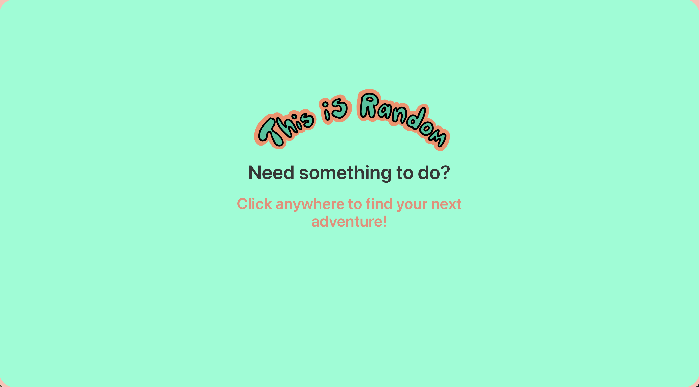
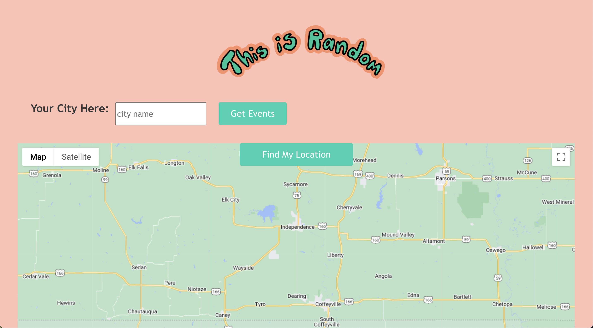
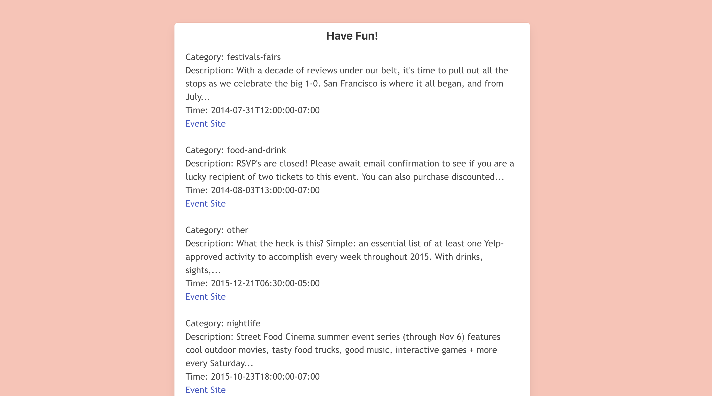

# this-is-random

User story:

As user I want to 
Randomly generate a list of events based on my location 
So that I don't have to decide what to do!

MVP:
The target audience would be people 21+ that are more spontaneous.
We are hoping to address the problem of indecisivenes.
We believe that the app can make the decision of what to do by giving random events based on current/certain location.

Acceptance Criteria:

Given the user visits the site, they are asked if they need help deciding what to do that day
Then, the user is able to input certain location and/or find current location in order to generate events near them
When the user is shown events, they are randomized and listed for user to choose from

Technologies Used: 

This application uses HTML, CSS, Bulma (CSS framework), Google Maps JS API, Google Maps Geocoding API, as well as Yelp Fusion API in order to provide the best user experience providing location and event data

[Link to our deployed application](https://rzaramba.github.io/this-is-random/)

[Link to our github repo](https://github.com/rzaramba/this-is-random)